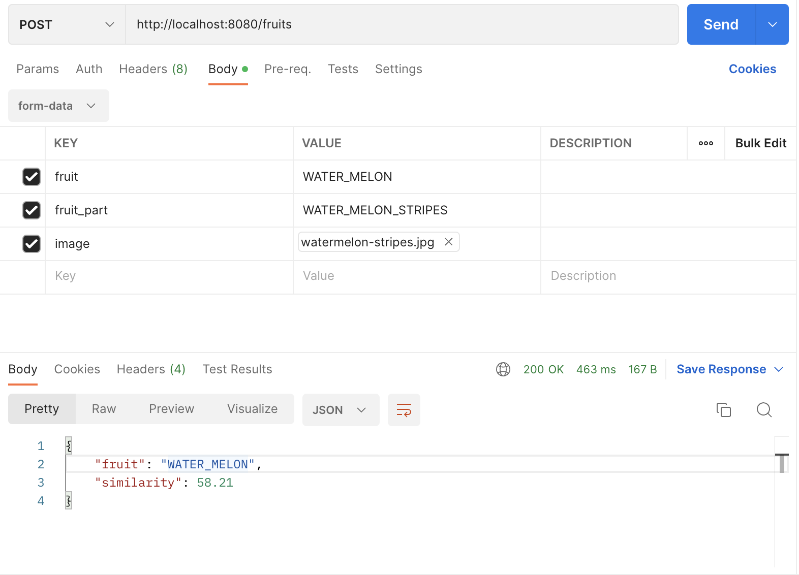
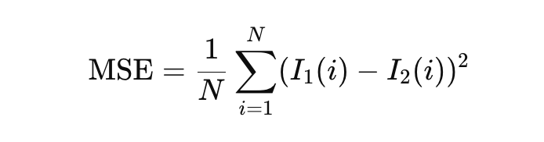
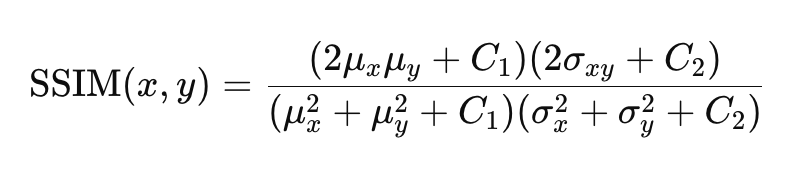
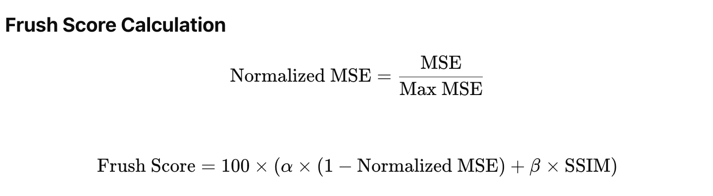

# Frush AI 백엔드 서버
Frush AI 백엔드 서버입니다.
## 개요
- 잘못된 요청에 대해서는 422 응답을 반환합니다.
- 모든 요청은 multi-part/form-data로 보내주셔야 합니다.
- 도커 이미지 빌드하기 `docker build -t frush-api:latest .`
- 도커 이미지 실행하기 `docker run --name frush-api -d -p 8080:8080 frush-api:latest`
- http://localhost:8080 포트로 접속하여 사용하면 됩니다.

## API
- 과일 분석 API: POST `http://localhost:8080/fruits`
- 요청 예시: 모두 multi-part/form-data로 보내주셔야 합니다!

    - fruit
        - WATER_MELON
        - ORIENTAL_MELON
        - PEACH
    - fruit_part
        - 수박
            - WATER_MELON_CIRCULAR → 원형
            - WATER_MELON_STRIPES → 줄무늬
            - WATER_MELON_NAVEL → 배꼽
        - 참외
            - ORIENTAL_MELON_NAVEL → 배꼽
            - ORIENTAL_MELON_OVAL → 타원형
            - ORIENTAL_MELON_INJURY → 상처
        - 복숭아
            - PEACH_RED → 붉은
            - PEACH_LINE → 골
            - PEACH_INJURY → 상처
    - image
        - 유저가 찍은 과일의 특정 부분 사진
- 응답 예시
```json
{
    "fruit": "WATER_MELON",
    "similarity": 58.21
}
```

## 이미지 유사도 알고리즘
1. MSE (평균 제곱 오차)
  

MSE는 두 이미지 간의 차이를 수치적으로 나타내는 지표입니다. 두 이미지의 각 픽셀 값 차이를 제곱한 후, 모든 픽셀에 대해 평균을 구함으로써 계산됩니다. 값이 클수록 두 이미지 간의 차이가 크다는 것을 의미하며, 값이 작을수록 두 이미지가 유사하다는 것을 의미합니다.  

2. SSIM (구조적 유사도 지수)
  

SSIM은 두 이미지의 구조적 유사도를 측정하는 지표로, 단순히 픽셀 단위의 차이뿐만 아니라 밝기, 대비, 구조적 정보 등을 종합적으로 고려합니다. SSIM 값은 0에서 1 사이의 값을 가지며, 1에 가까울수록 두 이미지가 유사하다는 것을 의미합니다.  

3. Frush 알고리즘
  

위의 MSE와 SSIM을 이용하여 이미지를 비교하고, 이를 바탕으로 과일의 당도 점수를 계산하는 수식입니다.
- Normalized MSE: MSE 값을 Max MSE로 나누어 0에서 1 사이로 정규화한 값입니다. 이 값을 통해 이미지 간 차이의 상대적인 크기를 파악할 수 있습니다.
- Frush Score: 이 점수는 이미지 유사도를 바탕으로 과일의 당도를 나타내는 점수입니다. MSE의 역수를 활용하여 이미지 차이가 적을수록 높은 점수를 부여하며, SSIM을 활용해 구조적 유사도도 반영합니다. α와 β는 MSE와 SSIM의 가중치를 조절하는 파라미터입니다.
- 테스트 결과 MSE 값이 이미지 유사도에 더 적합하여 α = 0.7, β = 0.3으로 적용했습니다.
